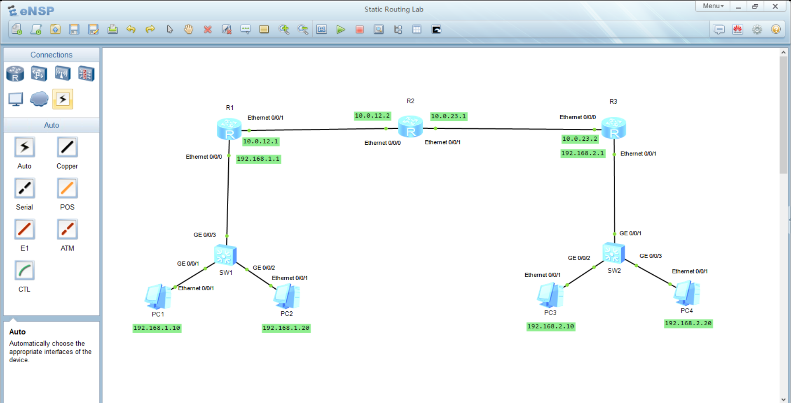

### Topology


### Configurations
1. configure the IP, subnet mask, and default gateway foreach PC
```bash
# example PC-1
IP:     192.168.1.10
subnet mask:     255.255.255.0
default gateway:     192.168.1.1
```
2. Foreach router, change its name and assign an IP on the interfaces
```bash
# Router 1
<Huawie> system-view
[Huawie] sysname R1
[R1] interface Ethernet 0/0/0
[R1-interface-Ethernet-0/0/0] ip address 192.168.1.1 24
[R1-interface-Ethernet-0/0/0] quit
[R1] interface Ethernet 0/0/1
[R1-interface-Ethernet-0/0/1] ip address 10.0.12.1 30
[R1-interface-Ethernet-0/0/1] quit
[R1] display current-configuration      # verify the interfaces IPs

# Router 2
<Huawie> system-view
[Huawie] sysname R2
[R2] interface Ethernet 0/0/0
[R2-interface-Ethernet-0/0/0] ip address 10.0.12.2 30
[R2-interface-Ethernet-0/0/0] quit
[R2] interface Ethernet 0/0/1
[R2-interface-Ethernet-0/0/1] ip address 10.0.23.1 30
[R2-interface-Ethernet-0/0/1] quit
[R2] display current-configuration      # verify the interfaces IPs

# Router 3
<Huawie> system-view
[Huawie] sysname R3
[R3] interface Ethernet 0/0/0
[R3-interface-Ethernet-0/0/0] ip address 10.0.23.2 30
[R3-interface-Ethernet-0/0/0] quit
[R3] interface Ethernet 0/0/1
[R3-interface-Ethernet-0/0/1] ip address 192.168.2.1
[R3-interface-Ethernet-0/0/1] quit
[R3] display current-configuration      # verify the interfaces IPs
```
3. Configure static routes 
```bash
# Router 1
[R1] ip route-static 192.168.2.0 24 10.0.12.2
[R1] display ip routing-table      # check the routing table

# Router 2
[R2] ip route-static 192.168.1.0 24 10.0.12.1
[R2] ip route-static 192.168.2.0 24 10.0.23.2
[R2] display ip routing-table      # check the routing table

# Router 3
[R3] ip route-static 192.168.1.0 24 10.0.23.1
[R3] display ip routing-table      # check the routing table
```
4. Finally, don't forget to save the configurations
```bash
# example R1
[R1] quit
<R1> save
```
5. Open termical from a PC in the `192.168.1.0/24` subnet & ping a PC in the `192.168.2.0/24` subnet.