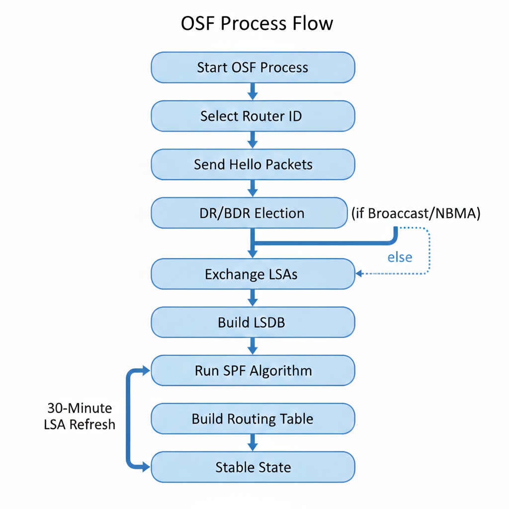

# 🌐 OSPF (Open Shortest Path First)

## 📌 Introduction

**OSPF (Open Shortest Path First)** is:

- A **Link-State Routing Protocol**
- An **IGP (Interior Gateway Protocol)** → Used inside one Autonomous System (AS)

### 🔎 How OSPF Selects the Best Path

OSPF chooses the best path based on:

> ⚡ **Cost** (which depends on link bandwidth)

Higher bandwidth → Lower cost → Preferred path

### 🔄 OSPF vs RIP

| OSPF | RIP |
|------|-----|
| Link-State | Distance Vector |
| Uses Cost (Bandwidth) | Uses Hop Count |
| Fast Convergence | Slow Convergence |
| Scalable | Limited Scalability |

---

# 🔄 OSPF Operation Phases

## 1️⃣ Hello Phase (Neighbor Discovery)

Routers send **Hello packets** to discover neighbors.

### ✅ Why Hello Packets?

- Discover OSPF neighbors
- Maintain neighbor relationships
- Check if neighbors are alive
- Elect DR/BDR (if required)

---

## ✅ Conditions to Form Neighbor Relationship

Two routers must match in:

- Area ID
- Subnet
- Hello Timer
- Dead Timer
- Authentication (if configured)
- Network Type
- Stub Area settings

If any parameter mismatches → ❌ No adjacency

---

## 2️⃣ LSA Exchange Phase

After neighbors are formed:

- Routers exchange **LSA (Link-State Advertisement)** packets
- LSA contains:
  - Connected networks
  - Router links
  - Link costs

All LSAs are stored in:

> 📚 **LSDB (Link-State Database)**

All routers in the same area must have **identical LSDBs**.

---

## 3️⃣ SPF Calculation Phase

After building LSDB:

- Router runs **SPF (Shortest Path First) Algorithm**
- Also called **Dijkstra Algorithm**

### What SPF Does:

- Converts LSDB into a **topology graph**
- Calculates best paths
- Builds the **Routing Table**

After that → Router enters **Stable State**

---

# ⏳ OSPF Stability & Timers

- If no topology changes occur → Network remains stable
- Every **30 minutes**, LSAs are refreshed (even without changes)
- If a change happens → SPF recalculates immediately

---

# 🆔 Router ID (RID)

Before sending Hello packets, each router selects a **Router ID**.

### 🔹 Router ID Characteristics

- 32-bit number (IPv4 format)
- Must be unique within OSPF domain
- Identifies the router

---

## 📌 Router ID Selection Order

1. Manually configured Router ID
2. Highest Loopback IP address
3. Highest Physical Interface IPv4 address

---

## 🔄 When Does Router ID Change Take Effect?

- After router restart
- After resetting OSPF process

---

# 🌍 OSPF Network Types

| Network Type | Description |
|--------------|-------------|
| Broadcast | Multiple routers connected via switch (Ethernet) |
| NBMA | Non-Broadcast Multi-Access (e.g., Frame Relay) |
| Point-to-Point | Direct connection between two routers |
| Point-to-Multipoint | One router connected to multiple routers logically |

---

# 🤔 Why OSPF Works Differently in Some Networks?

Because:

- Broadcast/NBMA → Multiple routers share same network
- P2P/P2MP → Fewer neighbor relationships

To reduce LSA traffic → OSPF elects DR & BDR in broadcast environments.

---

# 👑 DR & BDR Election (Broadcast & NBMA)

## 📌 Why Election?

Without DR:
- Each router forms adjacency with all others
- Too many LSA exchanges

With DR:
- Routers send LSAs to DR
- DR distributes LSAs to others
- Reduces traffic and complexity

---

# 👑 DR/BDR Election Timing

The **DR/BDR election happens AFTER Hello messages are exchanged.**

Order:

1. Routers send Hello packets.
2. Routers discover neighbors.
3. Neighbor relationships form.
4. DR/BDR election occurs (in Broadcast & NBMA networks).
5. LSA exchange begins.

⚠️ No Hello → No election.

---
## 🏆 Election Rules

Based on:

1. Highest OSPF Priority (0–255, default = 1)
2. Highest Router ID (if priority equal)

⚠️ Priority 0 → Cannot become DR or BDR

---

## 👥 Router Roles

- **DR** → Designated Router
- **BDR** → Backup Designated Router
- **DROther** → All other routers

---

# 🤝 Neighbor States

- **Neighbor** → Relationship between DROthers
- **Adjacent** → Full adjacency between:
  - DR ↔ DROther
  - BDR ↔ DROther

Only DR and BDR form full adjacency with all routers.

---

# 📡 OSPF Multicast Addresses

| Address | Purpose |
|----------|----------|
| 224.0.0.5 | All OSPF Routers |
| 224.0.0.6 | All DRs |

### Broadcast/NBMA Flow:

1. Routers send LSAs to DR/BDR → 224.0.0.6  
2. DR sends LSAs to all routers → 224.0.0.5  

---

# 🔗 OSPF in Point-to-Point & Point-to-Multipoint

- No DR/BDR election
- Priority = 0
- Routers communicate directly
- Use multicast: 224.0.0.5

### Why No Election?

- Only two routers (P2P)
- No need to reduce adjacency complexity

---

# 🔄 OSPF Phases (Simple Flow Graph)

  

---
